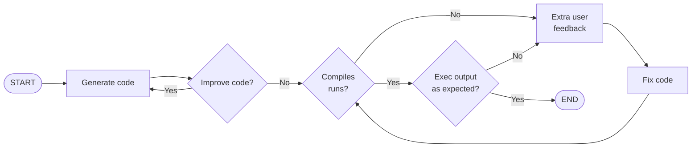

# olgpt - Oompa Loompa GPT

Harness the power of the GPT Oompa Loompas to assist you effortlessly.


## What is olgpt?

Yet another GPT powered agent to perform boring programming tasks.

First test version was working on less than 90 lines of code. Any code added
later is just bells and whistles. You can find this first version in commit:
[3f6886e](https://github.com/jpenalbae/olgpt/tree/3f6886ef214d0a4637b2498de038957eaca01e68)


## Motivation

When `0613` version of GPT-3 was released, I thought that the new
`function_call` functionality could be used to improve many automation tasks
such as code generation. Also olgpt would be an excuse to play with the idea of
autonomous agents building and testing code.

Previous to GPT-3 `0613` version, The way everyone was using GPT-3 to generate
code was to ask for code in a "specific" output format, generate an
intermediate file containing the files and dependencies which the project will
be composed of, then asking to generate each file one by one. This approach
produces many calls to the api, each new call must contain context from previous
calls causing a waste of tokens, Also the chances of getting a bad formatted
output increases with each api call, and the missing context could also produce
files with useless functions or missing dependencies. Using `0613` version` and
some clever tricks we can generate the hole code in just one call.

```mermaid
flowchart TD
    subgraph GPT Engineer - default
        BA([Start]) --> BB[Generate\n program specs]
        BB --> BC[Generate\n Unit tests]
        BC --> BD[Generate\n Code]
        BD --> BE[Generate\n Entry point]
        BE --> BF([end])
    end

    subgraph smol developer
        AA([Start]) --> AB[Create program structure\nlist of files]
        AB --> AC[Generate\n Shared dependencies]
        AC --> AD[Generate code\n for given file]
        AD --> AE{Any files remaining?}
        AE --> |Yes| AD
        AE --> |No| AF([end])
    end
    
    subgraph olgpt
        A([Start]) --> B[Generate all code\n Using function_call]
        B --> E([end])
    end
```

## Flowchart

asdasd


